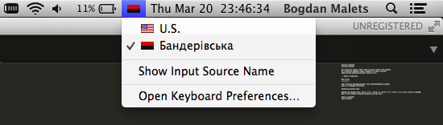

Cyrillic keyboard
=================

For particular reason I don't like to look at *that* flag anymore.
So I hacked my keyboard layout, changed its name, flag and
added missing Ukrainian-Cyrillic letters to it.

UPD: Added a version of standard "Cyrillic phonetic" keybord layout with a better flag.

How to install
--------------

* Copy 'Cyrillic bilingual.bundle' into /Library/Keyboard\\ Layouts like this:

.. code-block::

    cd /tmp && git clone https://github.com/muromec/bandera-layout.git
    cp -r bandera-layout/Cyrillic\ bilingual.bundle ~/Library/Keyboard\ Layouts/

* Go to language preferences, press "+" button and add "Cyrillic bilingual" layout from "English" group.

How to use
----------

Ukrainian-cyrillic keys:

- `alt-и` for і
- `alt-г` for ґ
- `alt-й` or `alt-§` for ї
- `alt-э` for є
- `alt-е` for ё

Bonus keys:

- `alt-ц`
